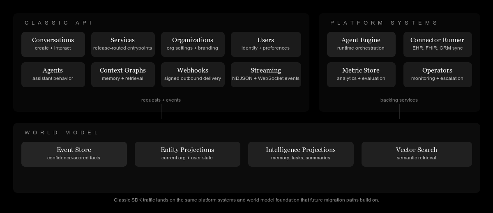

<p align="center">
  
</p>

<h1 align="center">@amigo-ai/sdk</h1>

<p align="center">Official TypeScript SDK for the classic Amigo API.</p>

<p align="center">
  <a href="https://docs.amigo.ai">Product Docs</a>
  ·
  <a href="https://docs.amigo.ai/developer-guide">Developer Guide</a>
  ·
  <a href="https://amigo-ai.github.io/amigo-typescript-sdk/">API Reference</a>
  ·
  <a href="https://github.com/amigo-ai/amigo-typescript-sdk/tree/main/examples">Examples</a>
  ·
  <a href="https://github.com/amigo-ai/amigo-typescript-sdk/blob/main/CHANGELOG.md">Changelog</a>
</p>

<p align="center">
  <a href="https://www.npmjs.com/package/@amigo-ai/sdk"></a>
  <a href="https://github.com/amigo-ai/amigo-typescript-sdk/actions/workflows/test.yml"></a>
  <a href="https://codecov.io/gh/amigo-ai/amigo-typescript-sdk"></a>
  <a href="https://opensource.org/licenses/MIT"></a>
</p>

Typed from the committed classic OpenAPI snapshot, shipped as ESM and CommonJS, and used by current org-scoped Amigo integrations.

## Classic API Context

The classic SDK is the typed client boundary between your application and the org-scoped Amigo API. It remains the right fit for current integrations that depend on the classic resource model while platform-native coverage expands.



## Product Status

`@amigo-ai/sdk` remains the supported TypeScript client for the classic Amigo API.

The Platform API is the long-term home for new workspace-scoped capabilities, but classic customers are not being asked to make an abrupt rewrite. As equivalent platform surfaces become available, Amigo will publish a migration path and upgrade guidance before recommending a move.

## Choose The Right SDK

| If you need                                                    | Use                                                                                   |
| -------------------------------------------------------------- | ------------------------------------------------------------------------------------- |
| The current org-scoped Amigo API used by existing integrations | `@amigo-ai/sdk`                                                                       |
| New workspace-scoped Platform API integrations                 | [`@amigo-ai/platform-sdk`](https://github.com/amigo-ai/amigo-platform-typescript-sdk) |

## Documentation

| Need                                    | Best entry point                                                                            |
| --------------------------------------- | ------------------------------------------------------------------------------------------- |
| Product overview and deployment context | [docs.amigo.ai](https://docs.amigo.ai/)                                                     |
| Integration guidance and developer docs | [Developer Guide](https://docs.amigo.ai/developer-guide)                                    |
| Generated API reference                 | [amigo-ai.github.io/amigo-typescript-sdk](https://amigo-ai.github.io/amigo-typescript-sdk/) |
| Runnable examples                       | [examples/](https://github.com/amigo-ai/amigo-typescript-sdk/tree/main/examples)            |
| Release history                         | [CHANGELOG.md](https://github.com/amigo-ai/amigo-typescript-sdk/blob/main/CHANGELOG.md)     |

## Installation

```bash
npm install @amigo-ai/sdk
```

## Quick Start

```typescript
import { AmigoClient } from '@amigo-ai/sdk'

const client = new AmigoClient({
  apiKey: 'your-api-key',
  apiKeyId: 'your-api-key-id',
  userId: 'user-id',
  orgId: 'your-organization-id',
})

const conversations = await client.conversations.getConversations({
  limit: 10,
  sort_by: ['-created_at'],
})

console.log(conversations.conversations.map(conversation => conversation.id))
```

## Configuration

| Option     | Type           | Required | Description                                                   |
| ---------- | -------------- | -------- | ------------------------------------------------------------- |
| `apiKey`   | `string`       | Yes      | API key from the Amigo dashboard                              |
| `apiKeyId` | `string`       | Yes      | API key ID paired with `apiKey`                               |
| `userId`   | `string`       | Yes      | User ID on whose behalf the request is made                   |
| `orgId`    | `string`       | Yes      | Organization ID for the classic API                           |
| `baseUrl`  | `string`       | No       | Override the API base URL. Defaults to `https://api.amigo.ai` |
| `retry`    | `RetryOptions` | No       | Retry policy overrides for transient HTTP failures            |

### Runtime Requirements

The SDK supports Node `18+` and is tested on active Node releases in CI. It relies on web-standard primitives such as `fetch`, `AbortController`, `URL`, and `TextEncoder`.

## Generated Types

The package re-exports the generated OpenAPI types so application code can type directly against the API contract:

```typescript
import type { components, operations, paths } from '@amigo-ai/sdk'

type Conversation = components['schemas']['ConversationInstance']
type GetConversationsQuery = operations['get-conversations']['parameters']['query']
```

Public builds are generated from the committed [`specs/openapi-baseline.json`](./specs/openapi-baseline.json) snapshot in this repo so type output stays deterministic across machines and CI runs. When you need to refresh that snapshot, run:

```bash
npm run openapi:sync
```

## Retries

The HTTP client retries transient failures with sensible defaults:

- Max attempts: `3`
- Backoff base: `250ms` with full jitter
- Max delay per attempt: `30s`
- Statuses: `408`, `429`, `500`, `502`, `503`, `504`
- Methods: `GET`, plus `POST` on `429` when `Retry-After` is present

## Error Handling

```typescript
import { AmigoClient, AuthenticationError, NetworkError } from '@amigo-ai/sdk'

try {
  const client = new AmigoClient({
    apiKey: 'your-api-key',
    apiKeyId: 'your-api-key-id',
    userId: 'user-id',
    orgId: 'your-organization-id',
  })

  await client.organizations.getOrganization()
} catch (error) {
  if (error instanceof AuthenticationError) {
    console.error('Authentication failed:', error.message)
  } else if (error instanceof NetworkError) {
    console.error('Network error:', error.message)
  } else {
    console.error('Unexpected error:', error)
  }
}
```

## Support

Use the [issue tracker](https://github.com/amigo-ai/amigo-typescript-sdk/issues) for bugs and feature requests. For responsible disclosure, see [SECURITY.md](https://github.com/amigo-ai/amigo-typescript-sdk/blob/main/SECURITY.md).
